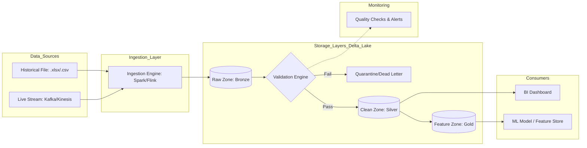

### 1.1 — End-to-End Architecture

### 1.2 — Component Descriptions

* **Data Sources:** The origin points. The historical batch file (Excel/CSV) provides the training baseline, while the live stream (row-by-row JSON/Avro) provides real-time operational data.
* **Ingestion Layer:** This component standardizes the incoming data. It receives raw files and stream events, performing initial schema enforcement before producing a unified stream of records for the landing zone.
* **Raw Storage (Bronze):** The "Source of Truth." It receives all ingested data and stores it in **Parquet** format, partitioned by `ingest_date`. This allows for full re-processing if downstream logic changes.
* **Validation Stage:** A logic gate that applies schema and business rules. It receives raw records and outputs either "Validated" records to the Clean layer or "Rejected" records to Quarantine.
* **Quarantine / Dead Letter Area:** A storage bucket for failed records. It receives the malformed data plus metadata about the failure (e.g., "Error: Negative UnitPrice"). Data is stored in **JSON** for easy manual inspection.
* **Transformation Stage:** The engine that turns raw rows into business value. It receives validated transactions and outputs enriched, cleaned, and aggregated datasets ready for consumption.
* **Storage Layers (Clean & Feature):** These layers use **Delta Lake** format. The Silver (Clean) layer stores row-level transactions, while the Gold (Feature) layer stores customer-level aggregates optimized for speed.
* **Consumer Interfaces:** The "Exit" of the pipeline. BI tools query the Silver layer via SQL, while ML models fetch pre-computed vectors from the Gold layer (Feature Store).
* **Monitoring:** A cross-cutting component that tracks data quality (using tools like Great Expectations). It monitors the ratio of quarantined records and triggers alerts if failures exceed a specific threshold (e.g., >2%).

---

### 2.1 — Validation Rules

| Category | Field | Rule |
| --- | --- | --- |
| **Schema** | `InvoiceNo` | String; Required; Non-empty. |
| **Schema** | `Quantity` | Integer; Required. |
| **Schema** | `CustomerID` | String/Numeric; Required for non-guest transactions. |
| **Value Range** | `UnitPrice` | Must be $> 0$ (unless it is a manual adjustment/gift). |
| **Value Range** | `InvoiceDate` | Must be between 2010-01-01 and the Current System Date. |
| **Value Range** | `Description` | String; Minimum length of 3 characters; No "Unknown" placeholders. |
| **Business Rule** | Cancellation Logic | If `InvoiceNo` starts with 'C', `Quantity` must be negative. |
| **Business Rule** | Logical Consistency | If `StockCode` is 'POST' (Postage), `UnitPrice` cannot be $0$. |
| **Business Rule** | Country Check | `Country` must belong to a predefined ISO-standard lookup list. |

### 2.2 — Error Handling Flow

1. **Rejection (Schema Failures):** Records with missing required fields or wrong data types are rejected immediately.
* **Destination:** Dead Letter Queue (DLQ) in S3/ADLS.
* **Alerting:** Real-time Slack/PagerDuty alert to the Data Engineering team.

2. **Quarantine (Business/Value Failures):** Records that are structurally sound but logically impossible (e.g., $UnitPrice = -50$).
* **Destination:** A "Quarantine Table" in the database.
* **Recovery:** A Data Steward reviews the table weekly. Once the source system is corrected, the operator triggers a "Replay" script that moves data from Quarantine back to the Ingestion Layer.

3. **Flagging (Minor Issues):** Missing non-critical fields (e.g., a missing `Description` where `StockCode` exists).
* **Action:** The record is accepted but a "Quality Warning" flag is appended to the row in the Clean layer for BI users to see.

---

### 3.1 — Defined Transformations

| Transformation | Input | Output | Idempotency |
| --- | --- | --- | --- |
| **Normalization** | Raw `Description` | Uppercase, trimmed strings | **Yes**: Re-running always yields the same string. |
| **Line Total Calculation** | `Quantity`, `UnitPrice` | `LineTotal` column ($Q \times P$) | **Yes**: Math is deterministic. |
| **Date Splitting** | `InvoiceDate` | `Year`, `Month`, `Day`, `Hour` | **Yes**: Based on a fixed timestamp. |
| **Customer Aggregation** | Validated Transactions | `TotalSpend`, `OrderCount` | **No (Initially)**: Use `MERGE` (Upsert) on `CustomerID` to make it idempotent. |
| **Feature Scaling** | `TotalSpend` | Scaled value $[0, 1]$ | **Yes**: If using fixed min/max parameters. |

### 3.2 — Storage Layers

| Layer | Contents | Format | Justification |
| --- | --- | --- | --- |
| **Raw** | Exact source copy | Parquet | High compression; allows for schema evolution over time. |
| **Clean** | Validated, row-level | Delta | Supports **Time Travel** (reading history) and ACID transactions for BI consistency. |
| **Feature** | ML-ready aggregates | Delta | Optimized for fast "Point-in-time" lookups; supports high-frequency updates. |

### 3.3 — Incremental Updates

* **Tracking:** We use a **High-Water Mark** strategy. The pipeline stores the maximum `ingest_timestamp` from the last successful run. New runs only fetch records where `timestamp > high_water_mark`.
* **Late-Arriving Data:** Handled via **Delta Lake MERGE**. If a transaction arrives 2 hours late, the system checks if the `InvoiceNo` exists. If yes, it updates; if no, it inserts.
* **Feature Refresh:** Customer-level features (Gold layer) are updated via a triggered micro-batch. When new transactions hit the Clean layer, the pipeline recalculates only the affected `CustomerIDs` to ensure the ML model always sees fresh data without a full table scan.
